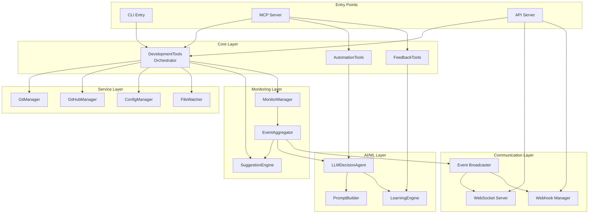

# Claude-Code-GitHub Architecture Analysis

## Executive Summary

The claude-code-github project demonstrates a sophisticated, event-driven architecture designed as an MCP (Model Context Protocol) server. The system follows modern software engineering practices with clear separation of concerns, plugin-based extensibility, and AI-powered automation capabilities.

## Architectural Diagram



## Architectural Patterns

### 1. **MCP Server Pattern**
- **Pattern**: Protocol-based server communicating via JSON-RPC 2.0
- **Implementation**: Base `McpServer` class with `EnhancedMcpServer` extension
- **Benefits**: Clean integration with Claude Code, standardized communication

### 2. **Plugin Architecture**
- **Pattern**: Dynamic tool registration with schema validation
- **Implementation**: Tools registered at runtime with handlers and schemas
- **Benefits**: Extensible, modular, easy to add new capabilities

### 3. **Event-Driven Architecture**
- **Pattern**: Event emission and aggregation for monitoring
- **Implementation**: `EventAggregator` with milestone detection
- **Benefits**: Decoupled components, real-time monitoring, reactive system

### 4. **Strategy Pattern (AI Providers)**
- **Pattern**: Pluggable AI provider implementations
- **Implementation**: `BaseLLMProvider` with factory creation
- **Benefits**: Support multiple LLMs, easy to add new providers

### 5. **Observer Pattern (Monitoring)**
- **Pattern**: Multiple monitors observing file/project changes
- **Implementation**: FileWatcher, AgentMonitor, ConversationMonitor
- **Benefits**: Comprehensive monitoring without tight coupling

## Architectural Strengths

### 1. **Separation of Concerns**
```typescript
// Each module has single responsibility
src/
├── ai/          // AI decision making
├── api/         // External interfaces
├── automation/  // Automation execution
├── learning/    // Machine learning
├── monitoring/  // Event monitoring
├── tools/       // Tool implementations
```

### 2. **Dependency Injection**
```typescript
// Good example from LLMDecisionAgent
setLearningEngine(learningEngine: LearningEngine): void {
    this.learningEngine = learningEngine;
    learningEngine.setLLMAgent(this);
}
```

### 3. **Configuration-Driven**
- Centralized configuration management
- Environment-specific settings
- Runtime configuration validation

### 4. **Error Handling**
- Custom error types for different scenarios
- Graceful degradation (e.g., LLM failure)
- Comprehensive error reporting

## Architectural Concerns

### 1. **Monolithic Orchestrator**
```typescript
// DevelopmentTools class is too large (900+ lines)
export class DevelopmentTools {
    // Too many responsibilities:
    // - Git operations
    // - GitHub operations  
    // - File watching
    // - Monitoring
    // - Status tracking
    // - Suggestion handling
}
```

**Recommendation**: Apply the Single Responsibility Principle
```typescript
// Proposed refactoring
export class GitOperationsService { }
export class GitHubIntegrationService { }
export class ProjectStatusService { }
export class DevelopmentOrchestrator {
    constructor(
        private gitOps: GitOperationsService,
        private github: GitHubIntegrationService,
        private status: ProjectStatusService
    ) {}
}
```

### 2. **State Management**
- State scattered across components
- No centralized state store
- Potential for state inconsistencies

**Recommendation**: Implement State Pattern
```typescript
interface ProjectState {
    branch: string;
    uncommittedChanges: FileChange[];
    suggestions: Suggestion[];
    automationMode: AutomationMode;
}

class ProjectStateManager {
    private state: ProjectState;
    private listeners: StateListener[] = [];
    
    updateState(updates: Partial<ProjectState>): void {
        this.state = { ...this.state, ...updates };
        this.notifyListeners();
    }
}
```

### 3. **Module System Inconsistency**
- Mix of CommonJS and ES modules
- Import paths inconsistent (.js extensions)
- Potential for runtime issues

**Recommendation**: Standardize on ES modules
```json
// tsconfig.json
{
    "compilerOptions": {
        "module": "ES2022",
        "moduleResolution": "node",
        "esModuleInterop": true
    }
}
```

### 4. **Type Safety**
- 135 warnings for `any` usage
- Reduces TypeScript benefits
- Potential runtime errors

**Recommendation**: Strict TypeScript configuration
```json
// tsconfig.json
{
    "compilerOptions": {
        "strict": true,
        "noImplicitAny": true,
        "strictNullChecks": true
    }
}
```

## Performance Considerations

### 1. **Event Aggregation**
- Events limited to 1000 (MAX_EVENTS)
- Good: Prevents memory issues
- Consider: Time-based cleanup

### 2. **File Watching**
- Uses chokidar for efficient watching
- Good: OS-native events
- Consider: Debouncing rapid changes

### 3. **API Rate Limiting**
- Implements express-rate-limit
- Good: Prevents abuse
- Consider: Per-user limits

## Security Architecture

### 1. **Authentication**
- Token-based auth for API/WebSocket
- Keychain storage for sensitive data
- Good: No hardcoded secrets

### 2. **Input Validation**
- Joi schemas for API validation
- Zod for type validation
- Good: Multiple validation layers

### 3. **Protected Operations**
- Branch protection enforcement
- Remote validation for pushes
- Good: Prevents accidental damage

## Scalability Analysis

### 1. **Horizontal Scaling**
- Stateless API server design
- WebSocket needs sticky sessions
- Consider: Redis for shared state

### 2. **Vertical Scaling**
- Event aggregation has limits
- File watching resource usage
- Consider: Worker processes

## Recommendations Priority

### High Priority
1. **Refactor DevelopmentTools** into smaller services
2. **Standardize module system** to ES modules
3. **Implement state management** pattern
4. **Reduce `any` usage** for better type safety

### Medium Priority
1. **Create service layer** abstraction
2. **Implement dependency injection** container
3. **Add architecture documentation**
4. **Extract shared constants**

### Low Priority
1. **Add metrics collection**
2. **Implement circuit breakers**
3. **Add request tracing**
4. **Create architecture decision records**

## Conclusion

The claude-code-github project demonstrates solid architectural foundations with room for improvement in modularity and consistency. The event-driven, plugin-based architecture provides excellent extensibility, while the AI integration shows forward-thinking design. Focus on reducing coupling and improving type safety will ensure long-term maintainability.

---

*Analysis performed using architectural best practices and SOLID principles*