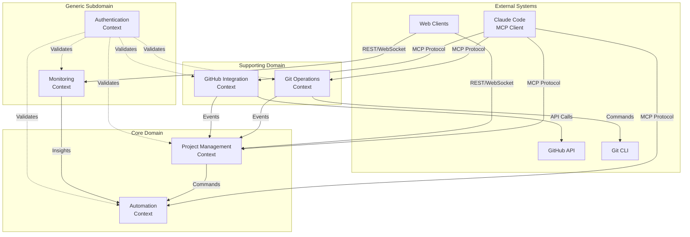
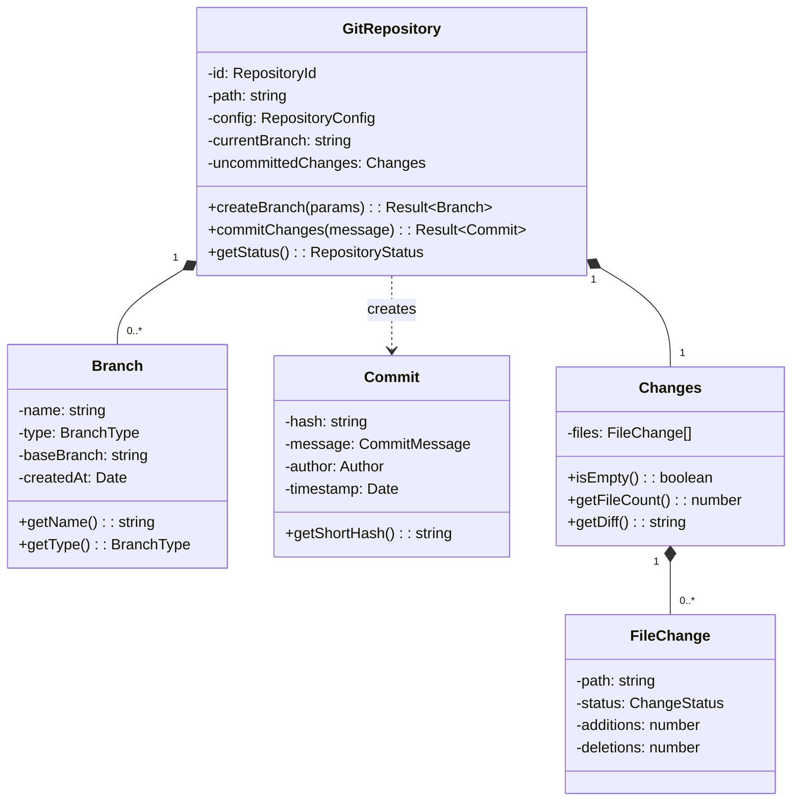
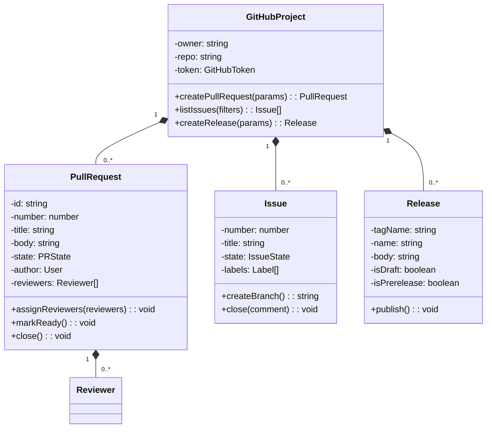
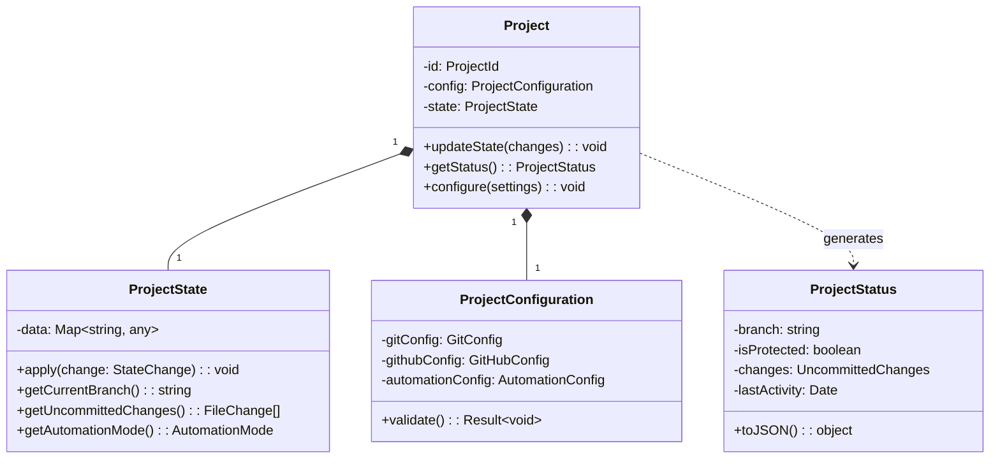
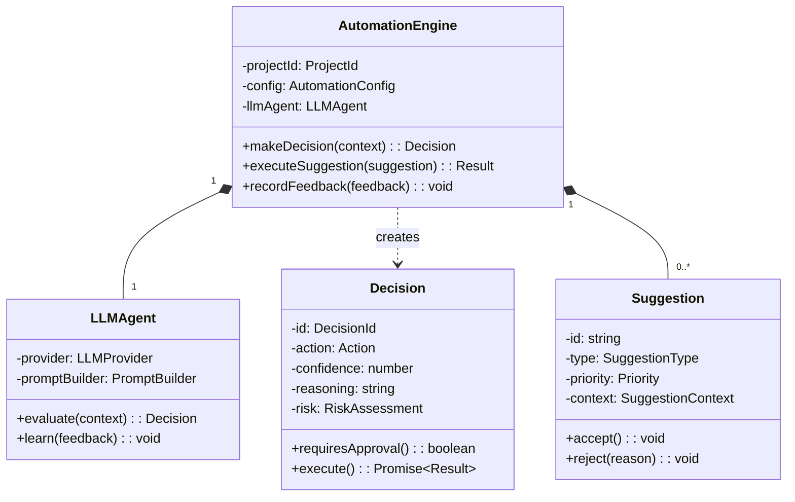
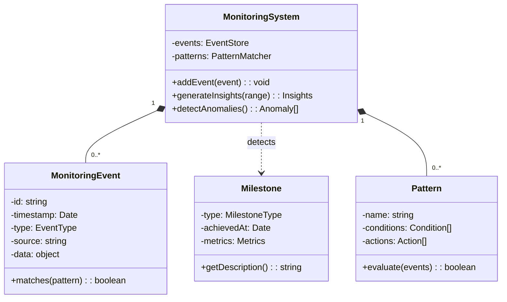
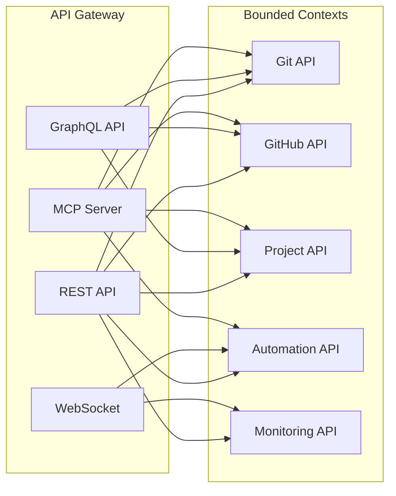
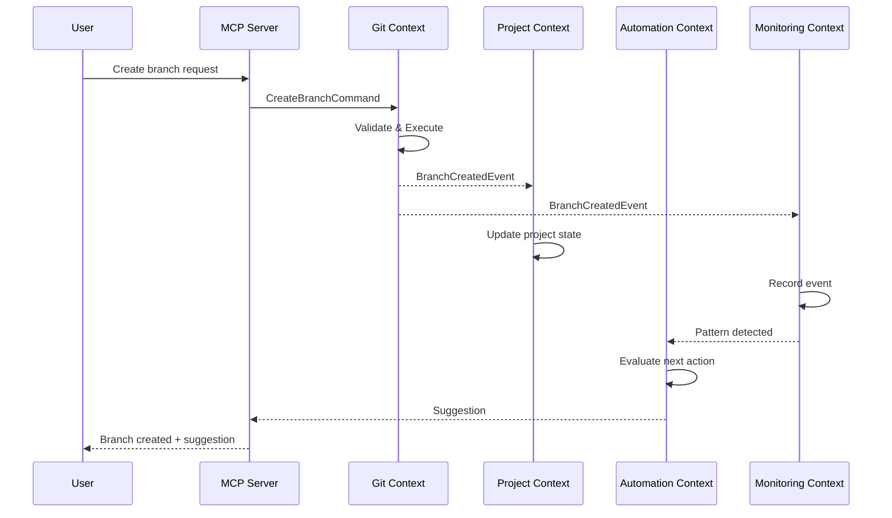
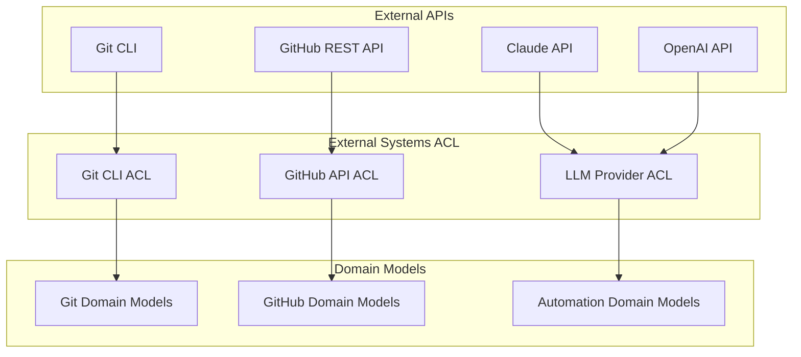
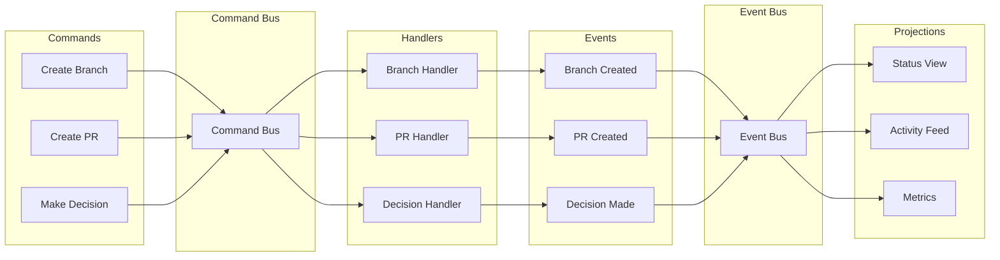

# Bounded Contexts Architecture Diagram

## Context Map Overview

## Detailed Context Boundaries

### 1. Git Operations Context

### 2. GitHub Integration Context

### 3. Project Management Context

### 4. Automation Context

### 5. Monitoring Context

## Integration Points

### API Gateway Pattern

### Event Flow

## Anti-Corruption Layers

## Data Flow Architecture

---

*This architecture ensures clear boundaries between contexts while maintaining loose coupling through events and well-defined interfaces.*