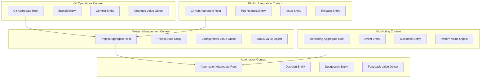
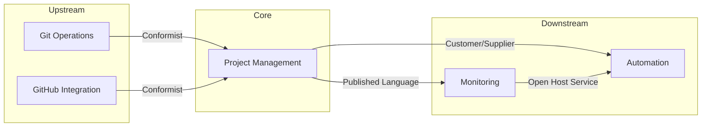

# Domain-Driven Design Architecture for Claude-Code-GitHub

## Executive Summary

This document presents a DDD-based architecture redesign that addresses the monolithic orchestrator problem by establishing clear bounded contexts, improving state management, and creating well-defined APIs for each domain.

## Domain Model Overview



## Bounded Contexts Definition

### 1. Git Operations Context
**Purpose**: Manages all local Git operations and file system interactions

```typescript
// Domain Entities
export class GitRepository {
    constructor(
        private readonly id: RepositoryId,
        private readonly path: string,
        private readonly mainBranch: string,
        private readonly protectedBranches: string[]
    ) {}

    createBranch(name: string, type: BranchType): Branch {
        // Domain logic for branch creation
        if (this.isOnProtectedBranch()) {
            throw new ProtectedBranchError();
        }
        return new Branch(name, type, this.getCurrentBranch());
    }

    commitChanges(message: CommitMessage): Commit {
        // Domain logic for commits
        const changes = this.getUncommittedChanges();
        if (changes.isEmpty()) {
            throw new NoChangesError();
        }
        return new Commit(message, changes);
    }
}

// Value Objects
export class CommitMessage {
    constructor(private readonly value: string) {
        this.validate();
    }

    private validate(): void {
        if (!this.value || this.value.length < 10) {
            throw new InvalidCommitMessageError();
        }
    }
}

// Domain Service
export interface GitOperationsService {
    getRepository(path: string): Promise<GitRepository>;
    executeOperation(repo: GitRepository, operation: GitOperation): Promise<void>;
}
```

### 2. GitHub Integration Context
**Purpose**: Handles all GitHub API interactions

```typescript
// Domain Entities
export class GitHubProject {
    constructor(
        private readonly owner: string,
        private readonly repo: string,
        private readonly token: GitHubToken
    ) {}

    createPullRequest(params: CreatePRParams): PullRequest {
        // Domain logic for PR creation
        return new PullRequest(
            this.generatePRId(),
            params.title,
            params.body,
            params.sourceBranch,
            params.targetBranch
        );
    }

    assignReviewers(pr: PullRequest, reviewers: Reviewer[]): void {
        // Domain logic for reviewer assignment
        const validReviewers = reviewers.filter(r => !r.isAuthor(pr));
        pr.assignReviewers(validReviewers);
    }
}

// Domain Events
export class PullRequestCreatedEvent implements DomainEvent {
    constructor(
        public readonly pullRequestId: string,
        public readonly projectId: string,
        public readonly createdBy: string,
        public readonly timestamp: Date
    ) {}
}
```

### 3. Project Management Context
**Purpose**: Central project configuration and state management

```typescript
// Aggregate Root
export class Project {
    private state: ProjectState;
    private readonly eventStore: DomainEventStore;

    constructor(
        private readonly id: ProjectId,
        private readonly config: ProjectConfiguration,
        eventStore: DomainEventStore
    ) {
        this.state = new ProjectState();
        this.eventStore = eventStore;
    }

    updateState(changes: StateChange): void {
        const previousState = this.state.clone();
        this.state.apply(changes);
        
        this.eventStore.publish(new ProjectStateChangedEvent(
            this.id,
            previousState,
            this.state,
            changes
        ));
    }

    getStatus(): ProjectStatus {
        return new ProjectStatus(
            this.state.getCurrentBranch(),
            this.state.getUncommittedChanges(),
            this.state.getLastActivity()
        );
    }
}

// State Management
export class ProjectState {
    private readonly stateData: Map<string, any> = new Map();
    
    apply(change: StateChange): void {
        switch (change.type) {
            case 'BRANCH_CHANGED':
                this.stateData.set('currentBranch', change.payload.branch);
                break;
            case 'FILES_MODIFIED':
                this.stateData.set('uncommittedChanges', change.payload.files);
                break;
            // ... other state changes
        }
    }
}
```

### 4. Automation Context
**Purpose**: AI-driven automation and decision making

```typescript
// Aggregate Root
export class AutomationEngine {
    constructor(
        private readonly projectId: ProjectId,
        private readonly config: AutomationConfig,
        private readonly llmAgent: LLMAgent
    ) {}

    async makeDecision(context: DecisionContext): Promise<Decision> {
        // Apply business rules
        if (!this.config.isEnabled()) {
            return Decision.createNoOp();
        }

        const decision = await this.llmAgent.evaluate(context);
        
        // Apply safety checks
        if (decision.risk > this.config.maxRiskTolerance) {
            decision.requireApproval();
        }

        return decision;
    }

    recordFeedback(decisionId: DecisionId, feedback: Feedback): void {
        const decision = this.getDecision(decisionId);
        decision.applyFeedback(feedback);
        
        // Emit learning event
        this.eventStore.publish(new FeedbackReceivedEvent(
            decisionId,
            feedback,
            decision.getOutcome()
        ));
    }
}
```

### 5. Monitoring Context
**Purpose**: Event aggregation and pattern detection

```typescript
// Aggregate Root
export class MonitoringSystem {
    private readonly events: EventStore;
    private readonly patterns: PatternMatcher;

    addEvent(event: MonitoringEvent): void {
        this.events.store(event);
        
        // Check for patterns
        const detectedPatterns = this.patterns.match(event);
        detectedPatterns.forEach(pattern => {
            this.publishMilestone(new Milestone(pattern, event));
        });
    }

    generateInsights(timeRange: TimeRange): MonitoringInsights {
        const events = this.events.query(timeRange);
        return new MonitoringInsights(
            this.analyzeActivity(events),
            this.detectAnomalies(events),
            this.predictNextActions(events)
        );
    }
}
```

## API Design

### 1. Git Operations API

```yaml
openapi: 3.0.0
paths:
  /api/v1/git/repositories/{repoId}/status:
    get:
      summary: Get repository status
      operationId: getRepositoryStatus
      parameters:
        - name: repoId
          in: path
          required: true
          schema:
            type: string
      responses:
        200:
          description: Repository status
          content:
            application/json:
              schema:
                $ref: '#/components/schemas/RepositoryStatus'

  /api/v1/git/repositories/{repoId}/branches:
    post:
      summary: Create a new branch
      operationId: createBranch
      parameters:
        - name: repoId
          in: path
          required: true
          schema:
            type: string
      requestBody:
        content:
          application/json:
            schema:
              type: object
              required: [name, type]
              properties:
                name:
                  type: string
                type:
                  type: string
                  enum: [feature, bugfix, refactor]
                commitMessage:
                  type: string
      responses:
        201:
          description: Branch created
          content:
            application/json:
              schema:
                $ref: '#/components/schemas/Branch'
```

### 2. GitHub Integration API

```yaml
  /api/v1/github/projects/{projectId}/pull-requests:
    post:
      summary: Create pull request
      operationId: createPullRequest
      parameters:
        - name: projectId
          in: path
          required: true
          schema:
            type: string
      requestBody:
        content:
          application/json:
            schema:
              type: object
              required: [title, body]
              properties:
                title:
                  type: string
                body:
                  type: string
                isDraft:
                  type: boolean
                  default: true
                reviewers:
                  type: array
                  items:
                    type: string
      responses:
        201:
          description: Pull request created
          content:
            application/json:
              schema:
                $ref: '#/components/schemas/PullRequest'
```

### 3. Project Management API

```yaml
  /api/v1/projects/{projectId}/state:
    get:
      summary: Get project state
      operationId: getProjectState
      parameters:
        - name: projectId
          in: path
          required: true
          schema:
            type: string
      responses:
        200:
          description: Current project state
          content:
            application/json:
              schema:
                $ref: '#/components/schemas/ProjectState'
    
    patch:
      summary: Update project state
      operationId: updateProjectState
      parameters:
        - name: projectId
          in: path
          required: true
          schema:
            type: string
      requestBody:
        content:
          application/json:
            schema:
              type: object
              properties:
                changes:
                  type: array
                  items:
                    $ref: '#/components/schemas/StateChange'
      responses:
        200:
          description: State updated
```

### 4. Automation API

```yaml
  /api/v1/automation/decisions:
    post:
      summary: Request automation decision
      operationId: requestDecision
      requestBody:
        content:
          application/json:
            schema:
              type: object
              required: [context]
              properties:
                context:
                  $ref: '#/components/schemas/DecisionContext'
      responses:
        200:
          description: Decision made
          content:
            application/json:
              schema:
                $ref: '#/components/schemas/Decision'

  /api/v1/automation/decisions/{decisionId}/feedback:
    post:
      summary: Provide feedback on decision
      operationId: provideFeedback
      parameters:
        - name: decisionId
          in: path
          required: true
          schema:
            type: string
      requestBody:
        content:
          application/json:
            schema:
              $ref: '#/components/schemas/Feedback'
      responses:
        204:
          description: Feedback recorded
```

## Context Mapping



## Anti-Corruption Layer

```typescript
// ACL for external Git operations
export class GitOperationsACL {
    constructor(
        private readonly gitManager: GitManager,
        private readonly mapper: DomainMapper
    ) {}

    async getRepositoryStatus(path: string): Promise<RepositoryStatus> {
        // Translate external Git data to domain model
        const gitStatus = await this.gitManager.status(path);
        return this.mapper.toDomainStatus(gitStatus);
    }
}

// ACL for GitHub API
export class GitHubACL {
    constructor(
        private readonly octokit: Octokit,
        private readonly mapper: DomainMapper
    ) {}

    async createPullRequest(pr: PullRequest): Promise<void> {
        // Translate domain model to GitHub API format
        const githubPR = this.mapper.toGitHubPR(pr);
        await this.octokit.pulls.create(githubPR);
    }
}
```

## Event Storming Results

### Domain Events
1. **BranchCreated** - When a new branch is created
2. **ChangesCommitted** - When changes are committed
3. **PullRequestOpened** - When a PR is created
4. **StateTransitioned** - When project state changes
5. **DecisionMade** - When automation makes a decision
6. **FeedbackReceived** - When user provides feedback
7. **PatternDetected** - When monitoring detects a pattern
8. **MilestoneReached** - When a milestone is achieved

### Commands
1. **CreateBranch** → BranchCreated
2. **CommitChanges** → ChangesCommitted
3. **CreatePullRequest** → PullRequestOpened
4. **UpdateProjectState** → StateTransitioned
5. **RequestDecision** → DecisionMade
6. **ProvideFeedback** → FeedbackReceived

## Migration Strategy

### Phase 1: Extract Bounded Contexts
1. Create new domain modules
2. Move relevant code to contexts
3. Maintain backward compatibility

### Phase 2: Implement Domain Models
1. Create entities and value objects
2. Implement domain services
3. Add domain events

### Phase 3: Build APIs
1. Create RESTful endpoints
2. Implement GraphQL schema
3. Add API versioning

### Phase 4: Refactor Integration
1. Update MCP tools to use new APIs
2. Migrate state management
3. Remove legacy code

## Benefits of This Design

1. **Clear Boundaries**: Each context has specific responsibilities
2. **Scalability**: Contexts can be deployed independently
3. **Maintainability**: Smaller, focused modules
4. **Testability**: Domain logic isolated from infrastructure
5. **Flexibility**: Easy to modify or extend contexts
6. **Type Safety**: Strong domain models with validation

---

*Design based on Domain-Driven Design principles by Eric Evans*